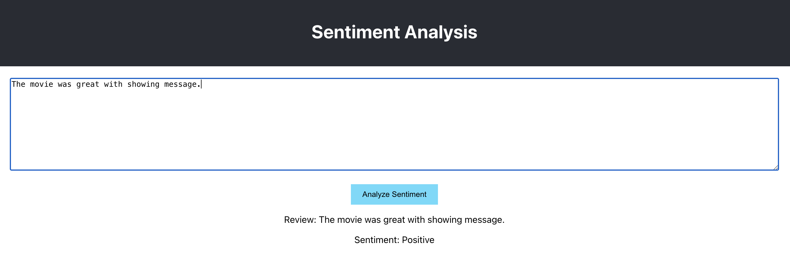

## Step 1: Create the Python Backend with Flask

Create Backend application in Python using Flask

## Step 2: Create the React Frontend

Create Frontend application using React

## Step 3: Running the Application

### Backend:

- Navigate to the backend directory.
- Install the dependencies:
  `pip install -r requirements.txt`
- Run the Flask application:
  `python app.py`

### Frontend:

- Navigate to the frontend directory.
- Start the React application
  `npm start`

## Testing the Application

1. Open your browser and navigate to http://localhost:3000.
2. Enter some reviews in the text area, one per line.
3. Click the "Analyze Sentiment" button.
4. The results will be displayed below the form.

